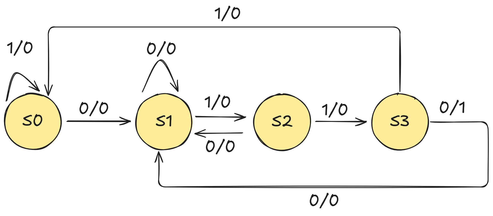
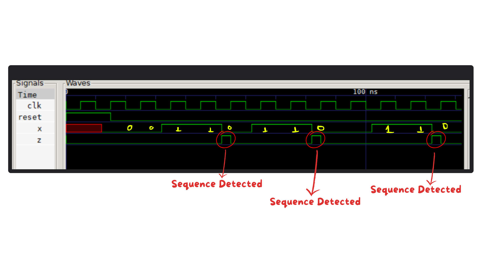

# Sequence Detector `0110` (Verilog)

## 📌 Overview
This project implements a **sequence detector** in **Verilog HDL** that detects the bit pattern **`0110`**.  

The detector is modeled as a **Finite State Machine (FSM)** and raises the output `z` high whenever the sequence is detected in the input stream. Both **overlapping** sequences are supported.

---

## 📂 Project Structure
   ```
├── docs/                 # Documentation, diagrams, notes
├── README.md             # Project overview and instructions
├── sq0110.v              # Main Verilog design file (Sequence Detector)
├── tb_sq0110.v           # Testbench file
├── sq0110.vcd            # Simulation waveform output (for GTKWave)
├── sqdect.vvp            # Compiled Icarus Verilog simulation file

   ```
---

## ⚙️ Requirements
- [Icarus Verilog](https://bleyer.org/icarus/) – Verilog simulator  
- [GTKWave](https://sourceforge.net/projects/gtkwave/) – waveform viewer  

---

## 🚀 How to Run
1. Clone this repository
     ```bash
     git clone https://github.com/CodeByHarshal/sequence-detector-0110/tree/main
     ```
     ```
     cd sequence-detector-0110
     ```
2. Compile the design and testbench:
     ```
     iverilog -o sq0110 sq0110.v tb_sq0110.v
     ```
3. Run the simulation
   ```
      vvp sq0110
   ```
4. Open the waveform in GTKWave
   ```
      gtkwave sq0110.vcd
   ```


## Example Input/Output :
  ```
Input (x):  0 0 1 1 0 1 1 0 0 1 1 0
Output (z):          1       1
  ```

## 🛠️ FSM Design
Below is the **state machine diagram** for detecting the sequence `0110`:  

<p align="left">
  
</p>


---

## 📊 Simulation Output
The waveform below shows the detection of the sequence `0110` using GTKWave:  

<p align="left">
  
</p>

 
